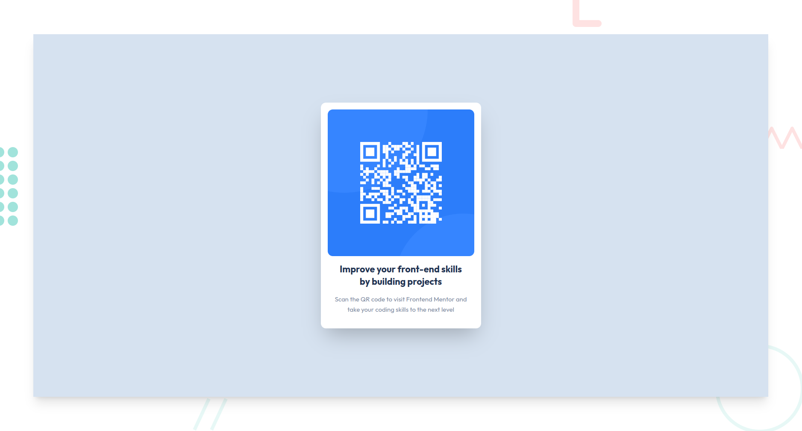

# Frontend Mentor - QR code component solution

This is a solution to the [QR code component challenge on Frontend Mentor](https://www.frontendmentor.io/challenges/qr-code-component-iux_sIO_H). As an
extra challenge I created the background using CSS.

[View live site](https://frontend-mentor-challenge-qr-code.vercel.app)

### Screenshot

### Built with

- [Vite](https://vitejs.dev)
- [React](https://reactjs.org/)
- [Tailwind CSS](https://tailwindcss.com) - For styles
